```{r setup, include = FALSE}
knitr::opts_chunk$set(fig.pos = 'H')
```

```{r packages, echo=FALSE, warning=FALSE, include=FALSE}
library(knitr)
library(rmarkdown)
library(bookdown)
library(knitcitations)
library(formatR)
library(devtools)
library(vembedr)

## Text results
opts_chunk$set(echo = TRUE, warning = TRUE, message = TRUE, include = TRUE)

## Code decoration
opts_chunk$set(tidy = TRUE, tidy.opts = list(blank = FALSE, width.cutoff = 60), highlight = TRUE)

## Caching code
opts_chunk$set(cache = 2, cache.path = "cache/")

## Plots
opts_chunk$set(fig.path = "Figures/", dev=c('pdf', 'png'), dpi = 300)

## Locate figures as close as possible to requested position (=code)
#opts_chunk$set(fig.pos = "H")

#Generate BibTex citation file for all R packages used to produce report
knitr::write_bib(.packages(), file = 'packagesch11.bib')
```

\newpage

# Introduction to GitHub and Git

GitHub is an open source repository that encourages team collaboration, peer review, and version tracking.  It is a great way to store and share your research.  In addition to securing your research in a remote location, it allows others to reproduce your research or even suggest improvements. 

Like many programs, there are multiple ways to do the same tasks.  Git is simply a way to access GitHub on your own computer.  You can manage your repository and do many of the same functions with either GitHub or Git/GitBash.  

The following are goals of this week's tutorial:  
  
**Day One**  
  
- **Part 1:** Using GitHub  
- **Part 2:** Using Git and GitBash  
  
**Day Two**  
  
- **Application** Using Git and GitBash  

# Learning Outcomes

This tutorial is intended to better understand Git and GitHub by learning the following:

- Introduction to GitHub and Git/GitBash
- Create a Repository
- Clone a Repository
- Create a Branch
- Make a Commit
- Open a Pull Request
- Merge a Pull Request

# Associated Files

This tutorial and supporting files may be found on the **Reproducible_Science** Google drive > **Bioinformatic_tutorials** > **Chapter_11**  

[Google Drive](https://drive.google.com/drive/folders/1mPQgIJ6QtmXoqFc8ocr6PzYaCmaCD5hC)

All documentations are in html formats 

- The documentation for Day 1 is found [here](https://phebianodufuwa.github.io/HTMLpages/Chapter_11)

- The documentation for Day 2 is found [here](https://phebianodufuwa.github.io/HTMLpages/Chapter_11_part_2.html)

- The documentation for the practice example (Day 2) is found [here](https://phebianodufuwa.github.io/HTMLpages/Documentation.html)

# Set-up[^1]
[^1]:https://happygitwithr.com/shell.html#shell

Before you start, you will need to make sure you have done the following:

1.  Create a GitHub account
2.  Install GitBash
3.  Check your settings in R 
4.  Install Visual Studio Code
  
- First, you will need to create a GitHub account.  

    Go to **GitHub** at https://github.com/  

    There are multiple plans available for your research.  For this tutorial, we will be using the free/public account.  Private repositories are available at a cost.  They restrict access to selected users.  This can be helpful while working on pre-published research or within a specific lab group or research team.  
    
    Select **Join for free**.  
    
    Enter a **Username** > **Email** > **Password** > **Sign up for GitHub**.    

```{r fig.1, echo=FALSE, fig.show="asis", out.width = '100%'}
knitr::include_graphics("Figures/Account_Options.png")
```
  
- Second, you will need to install Git software on your personal computers to be able to use Git/GitBash by downloading **Git** from https://git-scm.com/downloads  
  
  
- Third, you should check your Settings in R.  

    Set your working directory to current session by going to **Session** > **To source file location**.  You can also make this a global setting by going to **Tools** > **Global Options** > **General** > under the **Basic Tab** > **Default working directory (when not in project)** > type **~** > **Apply**. 

    Make sure your settings are up to date by going to **Tools** > **Global Options** > **Terminal** > under the **General Tab** > **New Terminals Open with: GitBash** > **Apply**.  

- Fourth, you will need to install Visual Studio Code on your personal computers by downloading **Visual Studio Code** from https://code.visualstudio.com/download


\newpage

# Part 1:  GitHub[^2]
[^2]:https://guides.github.com/activities/hello-world/#commit

Each research project is stored in a unique folder called a repository.  Once you create a repository and upload your code, data, figures, and etc.to GitHub, other people can access it.

All of the work can be downloaded on a user's local computer, allowing work offline.  When a user is ready to recommend changes, they can make a pull request.  It is then sent to the owner of the repository to determine if they want to merge the code.  As owner of the repository, you can see every update with change tracking and version history.  

### Definitions  
Understanding GitHub terminology can make your GitHub experience easier and more meaningful.

A **Repository** is organizes a single project. They can hold folders and files, images, videos, spreadsheets, data sets, and etc. 

**Branching** is a way to work on different versions of a repository at one time.  When you create a branch in your project, you're creating an environment where you can try out new ideas. Changes you make on a branch don't affect the main branch, so you're free to experiment and commit changes, safe in the knowledge that your branch won't be merged until it's ready to be reviewed by someone you're collaborating with.

A **Commit** is a saved change.  Each commit should have a description explaining why a change was made so others can understand what you have done and why.

**Pull Requests** are used when you are proposing a change and requesting that someone else reviews.  Essentially, your contribution is **pulled** in to be reviewed. Differences such as changes, additions, and subtractions are shown in green and red.  These diffs can be seen in all branches.

A **Merge Pull Request** brings your changes together once it has been reviewed and approved.

Let's look at an example on GitHub at https://github.com/mossmatters/HybPiper

### Create a Repository  
When you are ready to store and share your project in GitHub, you will need to create a **Repository**.  Remember that a **Repository** is organizes a single project. They can hold folders and files, images, videos, spreadsheets, data sets, and etc. You will want to create one for each project.  

To create a repository, go to your menu and select **Your repositories** + **New**.  

```{r Fig.2, echo=FALSE, fig.show="asis", out.width = '25%'}
knitr::include_graphics("Figures/Menu.png")
```
+ 
```{r fig.3, echo=FALSE, fig.show="asis", out.width = '10%'}

```
  
You will need to enter the **Repository name** > select the appropriate repository options > **Create repository** and fill in the following:  

- **Repository name** Remember that no spaces may be used in the repository name.
- **Description** is optional  
- Select **Public** or **Private**  
- Select **Add a README file**  
- **Add .gitignore** if you have extraneous files you do not want to show up on your open source code.  
- **Choose a license** if you have restrictions on your code or how your repository may be used.  

```{r Fig.4, echo=FALSE, fig.show="asis", out.width = '65%'}
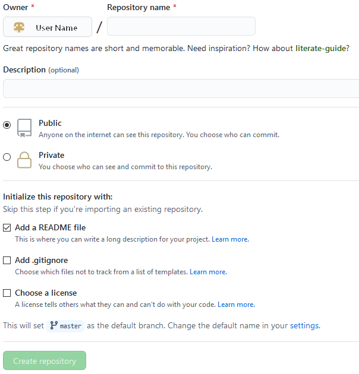
```
 
Once complete, you will see your repository.  Now you can add your code by uploading your file.  Select **Add file** and then  **Upload files** from the pull down menu.  A screen will pop up to either drag your file or select the file path for uploading.  

```{r fig.5, echo=FALSE, fig.show="asis", out.width = '40%'}
knitr::include_graphics("Figures/Upload_File.png")
```
    
Once you have uploaded your files, you want to **Commit directly to the master branch** > **Commit changes**.  Remember that a **Commit** is a saved change.  Each commit should have a description explaining why a change was made so others can understand what you have done and why.  

From the repository main page, you can now see the files you have uploaded. 

```{r fig.6, echo=FALSE, fig.show="asis", out.width = '100%'}
knitr::include_graphics("Figures/Confirm_Upload.png")
```

Make sure to check permissions and other settings for your repository by selecting **Settings** from the repository home page.

### Create a Branch  
Sometimes you may want to try something out or get feedback on your project without impacting the original file.  **Branching** is a way to work on different versions of a repository at one time.  When you create a branch in your project, you're creating an environment where you can try out new ideas. Changes you make on a branch don't affect the main branch, so you're free to experiment and commit changes, safe in the knowledge that your branch won't be merged until it's ready to be reviewed by someone you're collaborating with.

From your repository home page, select the **master** pull down menu and type in a new branch name where it reads **Find or create a branch**.  Once you type in the new branch name, select **create branch** at the bottom.  Now you see that there is a new branch.  

```{r fig.7, echo=FALSE, fig.show="asis", out.width = '40%'}
knitr::include_graphics("Figures/New_Branch.png")
```

You will also see that there is a specific URL or web address where the repository is stored. All repositories are identified by an unique URL.  This is where you copy the address to your clipboard.  This will be needed later when using Git or GitBash.  

You can also copy the repository by downloading the *.Zip file from here.

```{r fig.8, echo=FALSE, fig.show="asis", out.width = '40%'}
knitr::include_graphics("Figures/URL.png")
```

### Editing in GitHub  
Now you are ready to edit your file.  

Make sure you are in the correct branch.  This can be seen at **Switch branches or tags** pull down menu in the home repository page.  It will read **master** if you are in the master.  If you want to edit the branch, make sure it is selected before editing.  

```{r fig.9, echo=FALSE, fig.show="asis", out.width = '45%'}
knitr::include_graphics("Figures/Correct_Branch.png")
```

Now that you are in the correct branch, select the file you want to modify and then the the pencil in the top right corner to edit it.
```{r fig.10, echo=FALSE, fig.show="asis", out.width = '30%'}
knitr::include_graphics("Figures/Edit.png")
```
A new window will pop up for you to start editing right away.  

Let me demonstrate editing the **README.md** file.

### Commit your Changes  
When you are done making changes, select **Commit changes**.  Remember that a  **Commit** is a saved change.  Make sure your **Commit** has a description explaining why the change was made so others can clearly understand what you have done and why.   

```{r fig.11, echo=FALSE, fig.show="asis", out.width = '80%'}
knitr::include_graphics("Figures/Commit_Branch.png")
```

The branch file has been modified and is now different from the **master** repository file.

### Making a Pull Request  
**Pull Requests** are used when you are proposing a change and requesting that someone else reviews.  It is like a flag to the reviewer to check it before **Merging** it back into the project.  Essentially, your contribution is **pulled** in to be reviewed. Differences such as changes, additions, and subtractions are shown in green and red.  These differences (a.k.a. diffs) can be seen in all branches. 

Go to the repository home page and select 
```{r fig.12, echo=FALSE, fig.show="asis", out.width = '16%'}
knitr::include_graphics("Figures/pull_requests.png")
```
from the top of the page (just under the repository name). This will take you to the pull request page.  Select **Create pull request**.  

At the bottom of the page, you will see a pop-up window called **Example comparisons**.
```{r fig.13, echo=FALSE, fig.show="asis", out.width = '60%'}
knitr::include_graphics("Figures/Example_Comparisons.png")
```

Select the branch you just edited.  A page will pop-up that reads **Comparing changes**.  The bottom of the page will compare the files and highlight what has been changed.  If you are OK with the changes, enter a brief description in the **Write** tab.  You may use emoji or drag and drop images and gifs in the **Write** tab.  

When done, select **Create pull request**.  

Once you do this, you will see that there are conflicting documents.  
Go to the repository home page and select **Resolve conflicts**.  

```{r fig.14, echo=FALSE, fig.show="asis", out.width = '100%'}
knitr::include_graphics("Figures/Conflicts.png")
```

After you have selected **Resolve conflicts**, a screen will pop-up that highlights the changes.  Edit the file with the final version, then select **Mark as resolved** and **Commit merge**.  

### Merging a Pull Request  
A **Merge Pull Request** brings your changes together once it has been reviewed and approved.  It is the last step once you have confirmed or approved the changes and are ready to **merge** them into the **master** repository.  

If there are no conflicts, select **Merge pull request** from the branch and then **Confirm merge**.  Make sure to enter a brief description in the **Write** tab.  

When you go back to the repository home page, you will see **Merge** next to the file.

If you select the **branches** tab
```{r fig.15, echo=FALSE, fig.show="asis", out.width = '40%'}
knitr::include_graphics("Figures/Branches.png")
```
from the home page, you will see **Merged** and a trash can next to the branch you just merged.  Select the trash can to delete the branch.
```{r fig.16, echo=FALSE, fig.show="asis", out.width = '16%'}
knitr::include_graphics("Figures/Merged.png")
```

Congratulations!  The repository has been successfully updated and the branch has been deleted.

\newpage

# Part 2:  Git and GitBash [^3] , [^4]

[^3]:https://happygitwithr.com/shell.html#shell

[^4]:https://happygitwithr.com/push-pull-github.html#push-pull-github


Many of the same functions as GitHub can be done using Git or GitBash.
Here we show you the basics of Git including setting your working directory, adding a commit, branching, and finally pushing and pulling commits to and from GitHub. Git can be used without an internet connection and when you are ready, it is easy to push and pull information to GitHub. We will use the same commands in Git in the Shell or Terminal in Rstudio. 

When you download Git onto your machine, you have several applications to choose from: GUI, Git Bash, Power Shell ect. 
Since I have a windows computer, I will use Git Bash to show you the basics of Git. Keep in mind that the commands will be the same whether you are using the Shell, Git Bash, or even GitHub.


## Open Git or GitBash  
a.  For Windows, go to **Tools** > **Shell**. A window will pop-up for GitBash.  

b.  For macOS, open the Terminal.app.  It is typically located at ~/Applications/Utilities/Terminal.app or search for the app by typing Command + space and then **terminal**.  A window will pop-up for GitBash.  

c.  You can also type in Git directly in R from the **Terminal** tab next to the **Console** tab. 
```{r fig.17, echo=FALSE, fig.show="asis", out.width = '60%'}
knitr::include_graphics("Figures/Git_Terminal_Tab.png")
```

If you choose this option, go to **Terminal > Terminal Options > Terminal.** Select **New terminals Open with Git Bash.** Now, open a new terminal. 

```{r fig.18, echo=FALSE, fig.show="asis", out.width = '50%'}
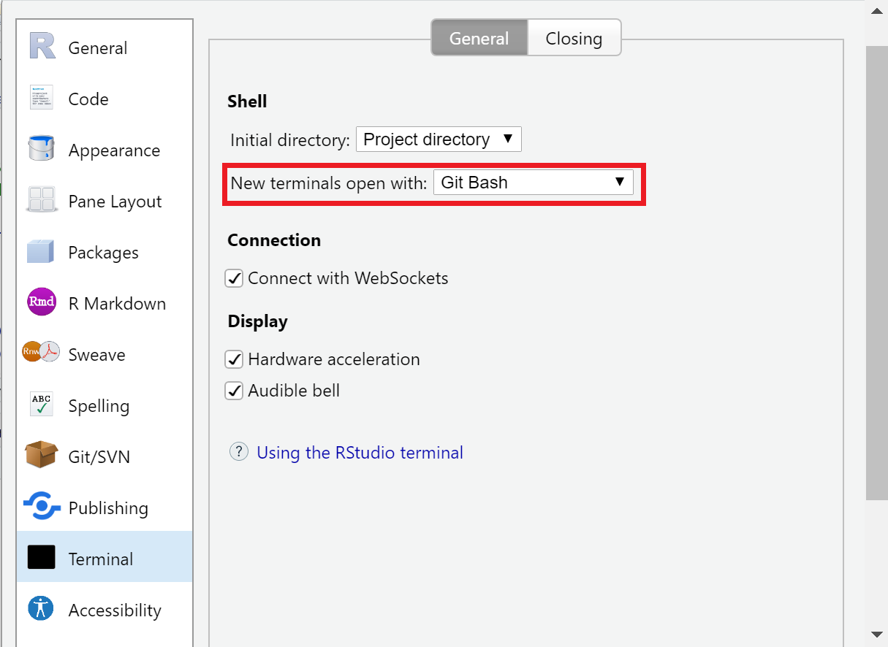
```


Note that a new window will not open.  This is the Git console. The only real difference between the two platforms is the **$**.  The commands are the same.

## Setting Up Git on Your Machine [^5]
[^5]: https://happygitwithr.com/hello-git.html

We will start with the basics: setting our username and user email in Git. You chose your user name, but it will be attached to your commits so be sure to choose something informative and clear, especially if you are collaborating. Your user email MUST be the email associated with your GitHub account. 

1. Use the `git config` command to configure your username and email. 


```{r fig.19, echo=FALSE, fig.align='Left', fig.show="asis", out.width = '50%'}
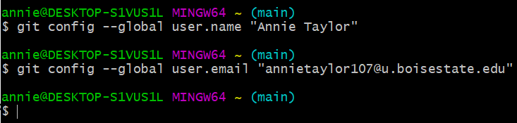
```

Now we want to configure a Git editor. This is also referred to as a Git client. A git editor is an integrated development environment. It essentially makes Git more user friendly and gives it a more informative visual representation. There are plenty of git clients to choose from, so you can do some research on it [here](https://git-scm.com/downloads/guis). For this presentation we will use **Visual Studio Code** as our git editor.  Today we will set it as our default editor and use it to display outputs. On Thursday we will use it in a real world example. 

Finally, we want to make sure git received the messages and has configured our local git the way we wanted.

1. Use the `git config --global core.editor "Visual Studio Code"` command to configure our core editor Visual Studio Code.

2. Use `git config --global --list` to check our git configurations.

```{r fig.20, echo=FALSE, fig.align='Left', fig.show="asis", out.width = '50%'}
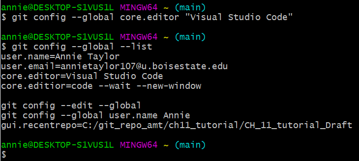
```


## SSH Keys [^6]
[^6]:https://jdblischak.github.io/2014-09-18-chicago/novice/git/05-sshkeys.html

SSH keys are a way to connect your local Git and GitHub account. After configuring an SSH key you wont have to enter your GitHub username and password when pushing and pulling from Git and GitHub. 

To set up and SSH key use the following steps:

1. if you are not sure if you have an SSH key already type `cd ~/.ssh` and then `ls` into the command line. If `id_rsa  id_rsa.pub` appear, you have already set up and SSH key for this computer. If this doesn't appear, you need to make a key pair.

2. To make a key pair type `ssh-keygen -o -t rsa -C "The email address used on your GitHub account"` Then, hit enter to accept the default file location.

3. You can choose if you want to use a passphrase or not. Hit enter x2 to skip the option, or create a passphrase.

4. You want to add a public key to GitHub. type `cat ~/.ssh/id_rsa.pub` to display the public key. Copy the output.

5. Open your GitHub. Go to **Settings > SSH and GPG keys > New SSH key**

6. Choose **Add SSH Key**, enter in a title, and then paste the key you copied from GitHub into the box under **Key**

Great work! Now we are set up to go- sometimes this seems like the hardest part. You only have to do configurations ONCE per machine you use. Now let’s get into some useful Git commands.

## The Help Command in Git [^7]
[^7]:https://git-scm.com/docs/git-help

To learn more about a git command you can add `--help` to the end of the command. Similar to the question mark command in R, this will pull up a page with information about the command. 

1.	If we want to know more about the configure command, we can type `git config --help`

```{r fig.21, echo=FALSE, fig.align='Left', fig.show="asis", out.width = '30%'}
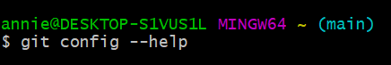
```

## Set your Working Directory[^8]
[^8]:https://englianhu.files.wordpress.com/2016/01/reproducible-research-with-r-and-studio-2nd-edition.pdf

Before you get started in Git or GitBash, you need to make sure it is properly set-up.

* From Git (the **Terminal** tab in R), this should already be set up at the beginning.  You may double check the path when the tab opens.  

The following commands can be used to set the working directory in GitBash:

1.	`mkdir ` followed by the name of the folder you want as your directory.The `mkdir` command literally makes a folder in the working directory that you specified.

2.	`cd` followed by the folder you want the directory to be in. `cd` stands for change directory; you are telling git to change the directory to a specific folder. If you already have a folder created that you want set as your directory you can skip the `mkdir` step and only do the `cd` step. 

Here is what it looks like in Git:

```{r fig.22, echo=FALSE, fig.align='Left', fig.show="asis", out.width = '50%'}
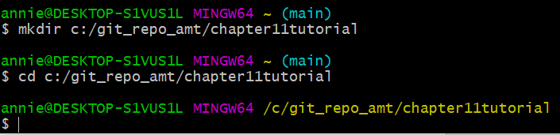
```

If you check your working directory you can see that Git made a new folder in my “git_repo_amt” folder called “chapter11tutorial.” You can also see that Git tells us our working directory in the command line.

## Important Commands in Git

Now that we have our working directory set, let’s make that into a repository. We can now use the `git init` command to set this directory as a repository. `Git init` tells Git to initialize a repository. 

```{r fig.23, echo=FALSE, fig.align='Left', fig.show="asis", out.width = '50%'}
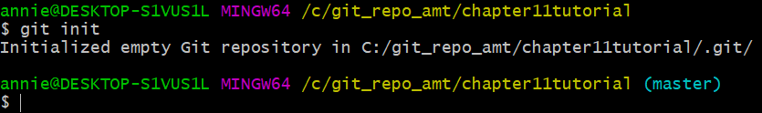
```

You can see that this automatically forces us on to the master branch of the repository
We will talk more about branching later in the tutorial. For now, be sure that your working off the master branch.

1. Now, let’s create a new README file and add some text to it by using the `echo` command. This file will be a simple example on how committing, branching and pushing looks like in Git. Notice that the README is a markdown file.

```{r fig.24, echo=FALSE, fig.align='Left', fig.show="asis", out.width = '50%'}
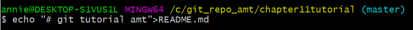
```

2.	To add the readme file to the repository we can use the `git add command`. There are two ways to do this.
 a.	`Git add README.md`
 b.	`git add .`

The first command will specifically add the README file to the repository. The second command is useful if you wanted to add all files to the repository. It is important to include the space and period after the command. Since we only have one file, either command would work. Here is what it looks like in Git:

```{r fig.26, echo=FALSE, fig.align='Left', fig.show="asis", out.width = '50%'}
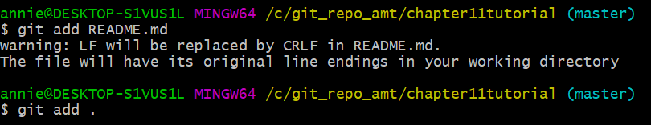
```

Now if we check our working directory, we can see that the README file is added. Since we set our Git editor to Visual Studio Code, we can see that the README.md automatically is pushed to that editor. 

3.	In order for git to track changes, we have to commit changes to the repository. The Git command used for committing changes is `git commit.`

```{r fig.27, echo=FALSE, fig.align='Left', fig.show="asis", out.width = '60%'}
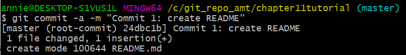
```

`-a` symbolizes that you want to commit the changes from all the files you have added to the repository.
`-m` is used so we can include a message attached to our commit. Messages are useful if you want to refer back to a previous commit. Here were chose "commit 1: create README" as our message.

## Creating Branches in Git

A branch is like and alternative version of your project. In a branch, you can play around with changes, without permanently altering your project. A branch is where you can test things, try new ideas without the fear or ruining the progress you made on your project. If you like your changes, you can merge the branch to your main branch.

1.	Use `git branch` to check if we have any existing branches in our repository.

```{r fig.28, echo=FALSE, fig.align='Left', fig.show="asis", out.width = '60%'}
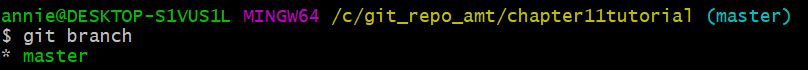
```

Here we can see we only have one branch called master. We know we are working on this branch because of the asterisk. 

2.	Create a branch type `git branch` followed by the branch name. Be sure to name of the new branch has no spaces. In my example I will call my new branch version2.

3.	Use the `git checkout` command to switch to the branch you created

4. The command `git checkout-b` allows steps 2 and 3 to be completed in one step.

Here is what it looks like in Git:

```{r fig.29, echo=FALSE, fig.align='Left', fig.show="asis", out.width = '60%'}
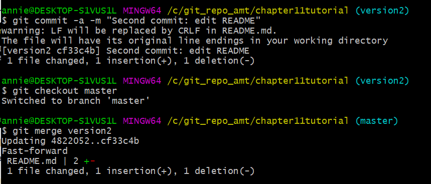
```

Now Git tells is we are on the version2 branch instead of the master branch.
To show how Git tracks changes, lets make a small change to our readme file. Remember when we added “git tutorial amt” text to the README document? Now, let’s make changes to that markdown document by changing your initials to full name, and add a quick note.

4.	Use the `echo` command to make changes to the text of our readme.

```{r fig.30, echo=FALSE, fig.align='Left', fig.show="asis", out.width = '60%'}
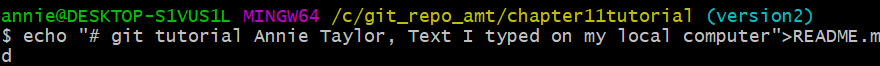
```

Before we commit our changes, let’s take a look at what we changed.

5.	Use `git diff` to see the changes in Git

```{r fig.31, echo=FALSE, fig.align='Left', fig.show="asis", out.width = '60%'}
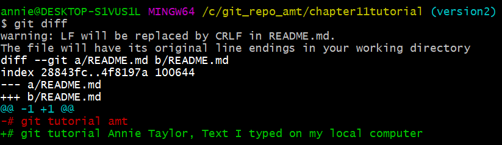
```

Since I like these changes, I want to commit them. Now when we try to commit, Git notifies us that the file has been changed. After committing the changes, we will merge the version2 branch back to the master branch.

6.	Commit the changes to the readme using `git commit -a -m “Commit changes from version2”`

7.	Use `git checkout` to switch back to the master branch.

8.	Use `git merge` to merge version2 to the master branch.

Here is what that looks like in Git:

```{r fig.32, echo=FALSE, fig.align='Left', fig.show="asis", out.width = '60%'}
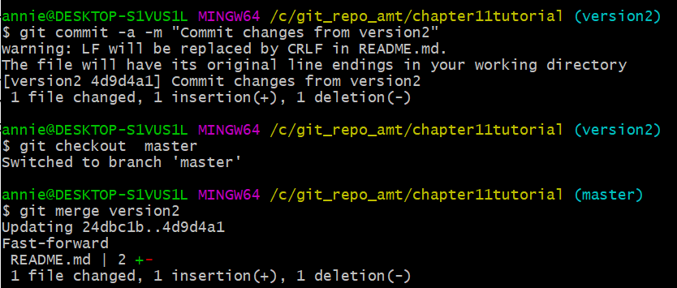
```

Now if we pull up Visual Studio Code, we see that are changes have been committed. The README file now shows my full name and the date. 

9.	And finally, to clean up, we can delete the branch we are no longer using: `git branch -d version2`

## Pushing and Pulling from Git and GitHub 

You can export repositories from Git to GitHub using the command line, as well as import repositories from GitHub to Git. This is called pushing and pulling.  We will continue working with our README file that we created earlier to show how this works.

### Cloning From GitHub

If you want to work on a project from GitHub on your local computer, you can clone the files from GitHub  To clone, hit the green button that says "code" and then the clipboard icon to copy the https. Cloning the repository is effectively downloading it to your computer to work offline.  Although you can download the file directly from GitHub, using Git or Git Bash to clone your repository is another option.For this example, I made a repository called "GitHub-Tutorial."

```{r fig.33, echo=FALSE, fig.align='Left', fig.show="asis", out.width = '30%'}
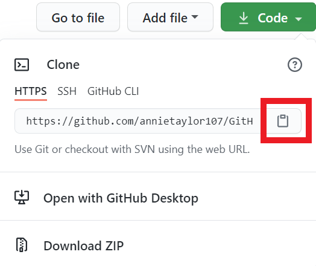
```

1. To import this from GitHub to your local Git use the `git clone` command.

```{r fig.34, echo=FALSE, fig.align='Left', fig.show="asis", out.width = '60%'}
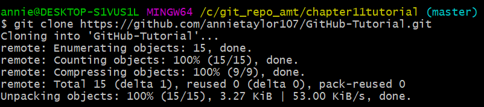
```

2. if you check your working directory, you can see that a new folder has been created that contains your project from GitHub.You can open the README and make edits from your local computer. When you are ready, you can push the edits back to GitHub.

### Pushing from Git to GitHub
Here is an example of how you can move files from Git into GitHub. First, you will want to make an empty repository on your GitHub account. I called mine "push-from-git." When you make an empty repository in GitHub, it prompts you with instructions to push from Git. In addition, you can find the steps below:

1.	`git remote add origin https://GitHub.com/USERNAME/repositoryname.git`  you can copy the https straight from GitHub when you make your empty repository. 
Here you are telling Git where to push your files to remotely.


2.	`git branch -M main`
In GitHub the master branch and the main branch are interchangeable. Before we push to GitHub, we have to move everything form our master branch into a main branch.

3.	`Git push -u origin main`
Then finally we can push our files to GitHub. The `-u` means upstream.

Here is what it looks like in Git:

```{r fig.35, echo=FALSE, fig.align='Left', fig.show="asis", out.width = '60%'}
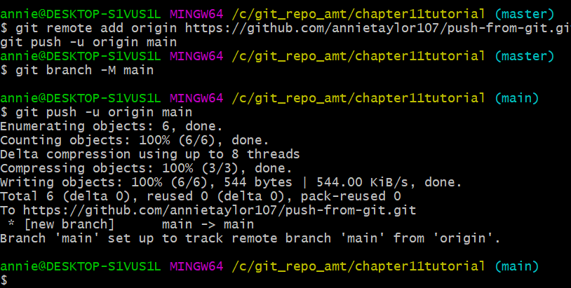
```

Now if you check your GitHub repository, you can see the files form our local Git have been pushed to our GitHub repository. Now you can view the README we created on our local computer on GitHub. Great job!

## Version Control with Git[^9]
[^9]:https://www.youtube.com/watch?v=HVsySz-h9r4&t=974s

Each commit you make in Git comes with a unique SHA Code associated with the commit. These codes are important in using the version control features in Git. If you want to revert back to a previous version of you project you can do so with the following steps:

1. Type `git log` into the command line. This will generate a list of all your previous commits with your attached message. Cope the code next to the word **commit**


2. type `git reset --hard ` and then paste the code associated with the commit you want to revert to.

```{r fig.36, echo=FALSE, fig.align='Left', fig.show="asis", out.width = '60%'}
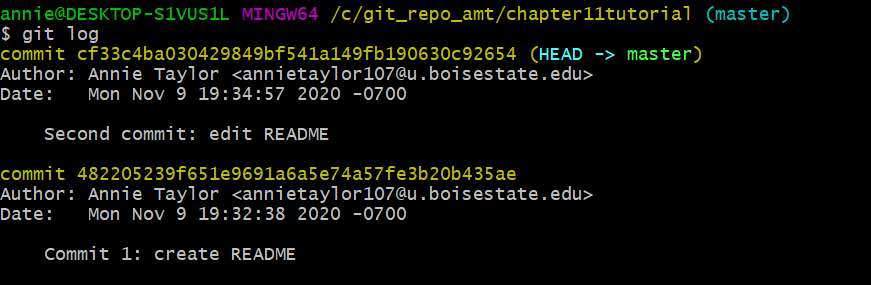
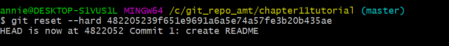
```


After setting up Git on Rstudio, you can use the same code in the terminal to implement version control with Rstudio.


# Conclusion  
Thanks for your attention throughout the tutorial. There are so many cool things you can do with Git and GitHub, we wish we had more time to show you. Luckily, there are excellent online tutorials we highly recommend you watch if you want to learn more. 

**More about version control with Rstudio:**  
```{r, video1, echo=FALSE, message=FALSE}

library(vembedr)

embed_url("https://www.youtube.com/watch?v=kL6L2MNqPHg")
```


**A nice overview of Git and GitHub:**
```{r video2, echo=FALSE}
embed_url("https://www.youtube.com/watch?v=RGOj5yH7evk")
```


**A quick intro to Git:**
```{r video3, echo=FALSE}
embed_url("https://www.youtube.com/watch?v=USjZcfj8yxE")
```


**More useful Git basics:**
```{r video4, echo=FALSE}
embed_url("https://www.youtube.com/watch?v=HVsySz-h9r4")
```


# References
[1] Jenny Bryan, the S.T.A.T.545 T.A.. Happy Git and GitHub for the useR. A The shell. Available at: https://happygitwithr.com/shell.html#shell [Accessed November 4, 2020].

[2] Anon. Hello World. Hello World · GitHub Guides. Available at: https://guides.github.com/activities/hello-world/#commit [Accessed November 4, 2020].


[3] Jenny Bryan, the S.T.A.T.545 T.A.. Happy Git and GitHub for the useR. A The shell. Available at: https://happygitwithr.com/shell.html#shell [Accessed November 4, 2020].


[4] Jenny Bryan, the S.T.A.T.545 T.A.. Happy Git and GitHub for the useR. Chapter 9 Connect to GitHub. Available at: https://happygitwithr.com/push-pull-github.html#push-pull-github [Accessed November 4, 2020].

[5] Jenny Bryan, the S.T.A.T.545 T.A.. Happy Git and GitHub for the useR. Chapter 7 Introduce yourself to Git. Available at: https://happygitwithr.com/hello-git.html [Accessed November 4, 2020].

[6] Anon. SSH Keys for GitHub. Available at: https://jdblischak.github.io/2014-09-18-chicago/novice/git/05-sshkeys.html [Accessed November 4, 2020].

[7] Anon. git-help Documentation. Git. Available at: https://git-scm.com/docs/git-help [Accessed November 4, 2020].

[8] Gandrud, C.. 2015. Reproducible research with R and RStudio. 2nd ed. CRC Press, Taylor & Francis Group, Boca Raton.Anon.

[9] Corey Sshafer “Git Tutorial for Beginners: Command-Line Fundamentals” YouTube, 9 Nov. 2020, https://youtu.be/bO7FQsCcbD8.


<div id="refs"></div>

# Appendix 1

Citations of all R packages used to generate this report. 

```{r generateBibliography, results="asis", echo=FALSE, warning = FALSE, message=FALSE}
library("knitcitations")
cleanbib()
options("citation_format" = "pandoc")
read.bibtex(file = "packagesch11.bib")
``` 

# Appendix 2

Version information about R, the operating system (OS) and attached or R loaded packages. This appendix was generated using `sessionInfo()`.

```{r eval=T, echo=F, warning = FALSE, message=FALSE}
sessionInfo()
```

